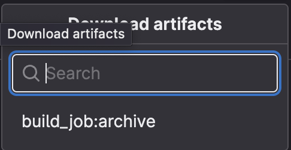
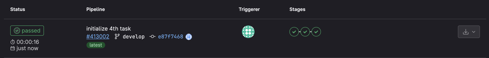

## Part 1. Настройка gitlab-runner
**== Выполнение ==**

#### Подними виртуальную машину Ubuntu Server 22.04 LTS.

#### Скачай и установи на виртуальную машину gitlab-runner.

#### Запусти gitlab-runner и зарегистрируй его для использования в текущем проекте (DO6_CICD).

## Part 2. Сборка
**== Выполнение ==**

### Напиши этап для CI по сборке приложений из проекта C2_SimpleBashUtils.
#### В файле gitlab-ci.yml добавь этап запуска сборки через мейк файл из проекта C2.

1) Сначала с помощью команды `echo` выводим сообщение о начале сборки
2) Затем переходим в директории с исходным кодом cat и grep соответственно
3) Далее собираем цели s21_cat и s21_grep с помощью make
4) В конце определяем артефакты, которые должны быть сохранены после завершения задачи на 30 дней

> Артефакты - это файлы или папки, которые будут доступны для скачивания или использования в следующих этапах пайплайна.
> В нашем случае артефакты - исполняемые файлы для cat и grep

#### После запушу все изменения в gitlab и перейду в раздел CI/CD
#### Видим, что пайплайн запускается и все в порядке

#### Файлы, полученные после сборки (артефакты), сохрани в произвольную директорию со сроком хранения 30 дней.
#### Артефакты доступны для загрузки, а срок 30 дней указан в конфиге

## Part 3. Тест кодстайла
**== Выполнение ==**

### Напиши этап для CI, который запускает скрипт кодстайла (clang-format).
#### Если кодстайл не прошел, то «зафейли» пайплайн.
#### В пайплайне отобрази вывод утилиты clang-format.

1) Добавил новый stage `code_style`
2) Переходим в директории с исходным кодом cat и grep соответственно
3) Форматируем .c и .h файлы
4) `git diff --exit-code` нужен для фейла пайплайна в случае, если кодстайл не прошел

#### Видим, что пайплайн запускается и все в порядке

#### Теперь изменю файл s21_cat.c так, чтобы он не прошел кодстайл
#### Пайплайн кодстайла фейлится:

## Part 4. Интеграционные тесты
**== Выполнение ==**

### Напиши этап для CI, который запускает твои интеграционные тесты из того же проекта.
#### Запусти этот этап автоматически только при условии, если сборка и тест кодстайла прошли успешно.
#### Если тесты не прошли, то «зафейли» пайплайн.
#### В пайплайне отобрази вывод, что интеграционные тесты успешно прошли / провалились.

#### Добавлю в файл конфигурации этот код:

#### Видим, что пайплайн запускается и все в порядке

#### Теперь изменю файл s21_cat.c так, чтобы он не прошел кодстайл
#### Пайплайн кодстайла фейлится, соответственно тесты даже не запускаются:

#### Добавлю в файл конфигурации код, который будет отображать результат тестов и фейлить пайплайн в случае неудачи

## Part 5. Этап деплоя
**== Выполнение ==**

#### Подними вторую виртуальную машину Ubuntu Server 22.04 LTS.

### Напиши этап для CD, который «разворачивает» проект на другой виртуальной машине.
#### Запусти этот этап вручную при условии, что все предыдущие этапы прошли успешно.
#### Напиши bash-скрипт, который при помощи ssh и scp копирует файлы, полученные после сборки (артефакты), в директорию /usr/local/bin второй виртуальной машины.

#### Настрою ssh подключение по внутренней сети:

#### В файле gitlab-ci.yml добавь этап запуска написанного скрипта.
#### В случае ошибки «зафейли» пайплайн.

## Part 6. Дополнительно. Уведомления
**== Выполнение ==**

## Настрой уведомления об успешном/неуспешном выполнении пайплайна через бота с именем «[твой nickname] DO6 CI/CD» в Telegram.

#### Текст уведомления должен содержать информацию об успешности прохождения как этапа CI, так и этапа CD.
#### В остальном текст уведомления может быть произвольным.

> Я создал своего бота через @BotFather и добавил его в свой чат
> Затем создал скрипт telega.sh в папке src и добавил build для телеги в конфиг

